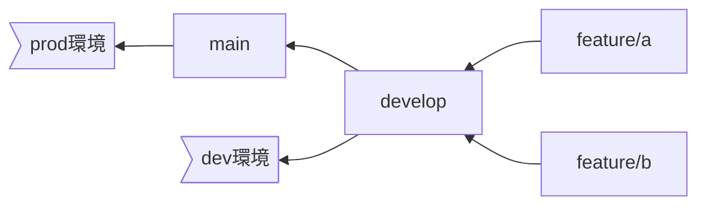
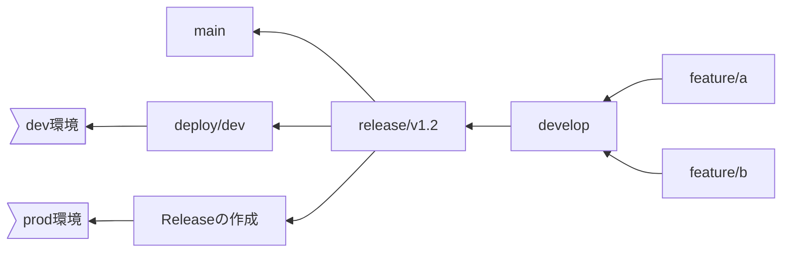

## はじめに

GitHub ReleaseとGitHub Actionsを利用し、受託案件におけるリリース管理の効率化を図る方法を解説します。

## 要約

- ブランチ運用の改善: releaseブランチを導入し、developブランチのマージを停止することなく、リリース確認中も開発を継続できるようにしました。 GitHub Releaseの導入: Release起点のCI/CDを作成しました。リリースノートの自動生成機能により、リリースの差分が確認しやすくなりました。

## 課題

弊社のとある案件では、毎週リリースしています。これまでは、以下のようなブランチ運用をしていました。



- prod環境: 本番稼働している環境
- dev環境: クライアント側で確認作業を行う環境

上記のフローでは、開発ブランチであるdevelopが直接dev環境に反映されるため、確認中にdevelopブランチの変更が反映されてしまい、確認フェーズでのブロッキングが発生します。そのため、確認中はマージを停止したり、開発を中断する必要がありました。

## 改善

そこで、運用フローを改善し、GitHub Releaseを使用するようにしました。



改善後の運用フローでは、releaseブランチを導入し、prod環境への反映にGitHub Releaseを活用するようにしました。releaseブランチを導入することで、developブランチのマージを停止する必要がなくなり、確認中も開発を継続できるようになりました。

### GitHub Releaseの利用

GitHub Releaseについて説明します。

Releaseは、ブランチやタグを選択して作成できます。


タグを作成。


「Generate Release notes」ボタンでリリースノートが作成されます。


v1.0をリリース。


### GitHub actionsの設定

GitHub Releaseが公開されたときにデプロイするCIは以下のトリガーで作成できます。

```yml:deploy.yml
name: Deploy
on:
  release:
    types: [published]
```

これによりReleaseの公開→デプロイというフローを作成できます。

## おわりに

GitHub Releaseを活用し、開発フローを改善しました。リリースノートの自動生成機能により、差分確認も容易になりました。ぜひ導入を検討してみてください。
