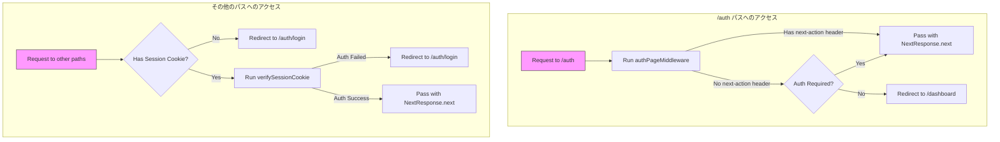

## はじめに
Firebase Authを利用している際に、認証情報をServer Componentsから利用する方法について解説します。

## 要約

### 構成
認証用ページと認証後のダッシュボードページがある想定です。

```
/
├─ app
│  ├─ auth
│  └─ dashboard
└─ middleware.ts
```

### 1. サインイン
クライアントでFirebase Authを利用してサインインをします。
サインインが成功すると`idToken`が発行されます。これを利用してバックエンドでセッションを開始します。

```tsx:auth/page.tsx
const handleSubmit = async (input) => {
  const userCredential = await signInWithEmailAndPassword(getAuth(), input.email, input.password)
  const idToken = await userCredential.user.getIdToken()

  await startSessionAction(idToken)
}
```

### 2. セッションの開始

取得した`idToken`をserverActionに送り、セッションクッキーの作成とセットをした後、ダッシュボードページへリダイレクトします。

```ts:actions.ts
export async function startSessionAction(
  firebaseIdToken: FirebaseIdToken,
) {
  const sessionCookie = await createSessionCookie(firebaseIdToken)

  setSessionCookieToCookie(await cookies(), sessionCookie)

  const path = '/dashboard'
  redirect(path)
}
```
セッションクッキーの作成には`firebase-admin`の`auth`を利用します。

:::details
```ts
import { auth } from 'firebase-admin'

export const SESSION_COOKIE_KEY_NAME = '__session'
export const SESSION_COOKIE_MAX_AGE_SEC = 86400 * 7 // 7days in seconds

export function createSessionCookie(firebaseIdToken: FirebaseIdToken) {
  return auth.createSessionCookie(firebaseIdToken, {
    expiresIn: SESSION_COOKIE_MAX_AGE_SEC * 1000
  })
}

export function setSessionCookieToCookie(
  cookies: ReadonlyRequestCookies | RequestCookies | ResponseCookies,
  sessionCookie: SessionCookie
) {
  cookies.set({
    name: SESSION_COOKIE_KEY_NAME,
    value: sessionCookie,
    maxAge: SESSION_COOKIE_MAX_AGE_SEC,
    httpOnly: true,
    secure: true,
    sameSite: 'strict'
  })
}
```
:::

### ミドルウェアの作成

ミドルウェアで行なうことを図解します。
どちらも認証状態を見て未認証であれば認証ページへ、認証済みであればダッシュボードページへリダイレクトしています。



ミドルウェアに関する実装は長くなるのでアコーディオンに詰めておきます。

:::details middleware.ts
```ts:middleware.ts
export async function authMiddleware(req: NextRequest) {
  if (req.nextUrl.pathname.startsWith('/api')) {
    return NextResponse.next()
  }

  // /auth の場合
  if (req.nextUrl.pathname.startsWith('/auth')) {
    return await authPageMiddleware(req)
  }

  const sessionCookie = extractSessionCookie(req.cookies)
  if (!sessionCookie) {
    console.error('session cookie not found')

    const redirectTo = encodeURIComponent(
      `${req.nextUrl.pathname}${req.nextUrl.search}${req.nextUrl.hash}`
    )
    return NextResponse.redirect(
      new URL(
        `/auth/login?error-code=SESSION_COOKIE_NOT_FOUND&redirectTo=${redirectTo}`,
        req.nextUrl
      )
    )
  }

  const verifiedPayload = await verifySessionCookie(sessionCookie)
  if (verifiedPayload instanceof TaggedError) {
    console.error(verifiedPayload)

    const redirectTo = encodeURIComponent(
      `${req.nextUrl.pathname}${req.nextUrl.search}${req.nextUrl.hash}`
    )
    return NextResponse.redirect(
      new URL(`/auth/login?error-code=${verifiedPayload.tag}&redirectTo=${redirectTo}`, req.nextUrl)
    )
  }

  return NextResponse.next()
}

async function authPageMiddleware(req: NextRequest) {
  // server action の場合はリクエストをそのまま通す
  if (req.headers.has('next-action')) {
    return NextResponse.next()
  }

  const shouldAuthenticate = await checkShouldAuthenticate(req)

  if (shouldAuthenticate) {
    // 認証が必要なときはそのまま通す
    return NextResponse.next()
  } else {
    // 認証が不要なときは/ページにリダイレクト
    return NextResponse.redirect(new URL('/dashboard', req.nextUrl))
  }
}
```
:::


## まとめ

## 参考文献
- [セッション Cookie を管理する  |  Firebase Authentication](https://firebase.google.com/docs/auth/admin/manage-cookies?hl=ja)
- [firebase auth で cookie での session 管理試す](https://zenn.dev/nbstsh/scraps/7acd43e3e8116e)
