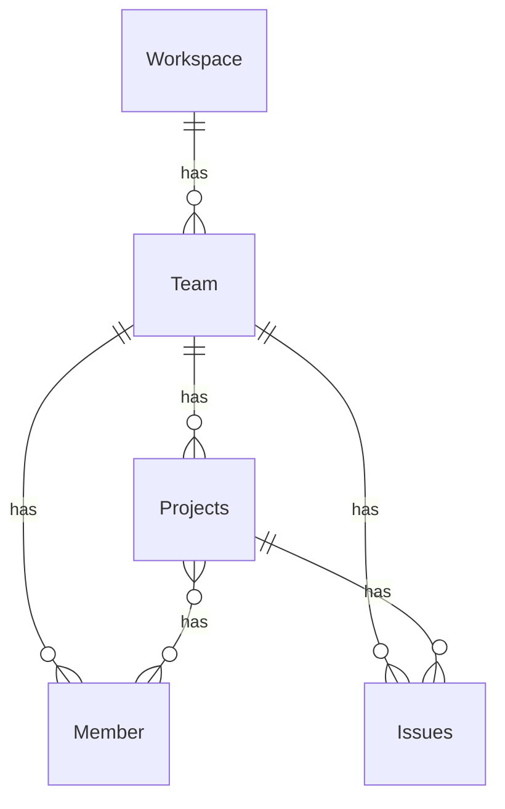

## はじめに

弊社ではNotionのタスク管理機能を使ってプロジェクトやエンジニアのチケット管理をしていましたが、Notionのプラン内容の変更などを機にLinearへ移行しました。

今回はLinearでの基本のプロジェクト管理機能について紹介します。

## 全体構成
Linearには上位の概念からWorkspace > Team > Project / Issueという構成があります。
IssueはTeamに紐づき、ProjectはIssueに対するグルーピングのような役割になっています。

## チームの設計

*Team View*

チームには下記のプロパティを設定できます。

- アイコン
- チーム名
- 説明
- ドキュメント
- メンバー
- Slack channel: 通知用のチャンネル設定

チームドキュメントではチーム定例の議事録などを管理できます。
TeamのViewでは複数のプロジェクトの案件が一覧で見られる形になります。

弊社では「受託チーム」を作成して運用しています。

## プロジェクトの設計

プロジェクトには下記のプロパティを設定できます。

- アイコン
- プロジェクト名
- プロジェクト概要
- ステータス: Backlog / Planned / In Progress / Completed / Canceled
- 優先度: Urgent / High / Medium / Low
- 期間
- Slack channel: 通知用のチャンネル設定
- ラベル
- マイルストーン
- メンバー: チームメンバーから選択
- リードメンバー: チームメンバーから選択
- ドキュメント: プロジェクト関連ドキュメントを管理（Teamからも参照可）

弊社では受託チーム内で、案件ごとにProjectを作成しました。
案件化が未確定のものはBacklogに登録するなど、ステータスを活用しました。

*Project View*

*Project List*

## Issueの設計

*Issue View*

Issueには下記のプロパティを設定しています。

- ステータス: Backlog / Todo / In Progress / In Review / Done / Canceled / Duplicate
- 担当者
- 見積り工数
- ラベル
- タイトル
- 本文

ラベルはレイヤ分類として下記を付けています。

- フロントエンド
- バックエンド
- インフラ
- 開発環境整備
- 要件定義・設計
- Bug

見積り工数についてはフィボナッチ数で設定しています。
見積り工数はClockifyという稼働管理ツールと組み合わせて実績計測に使ったり、スプリントで消化したポイント指標として使っています。

## まとめ
Linearの基本的な概念について紹介しました。
Linearではこれらの上に、InitiativesやCycle、AI Agentなどの便利な機能があります。

ぜひLinearを導入してみてください。