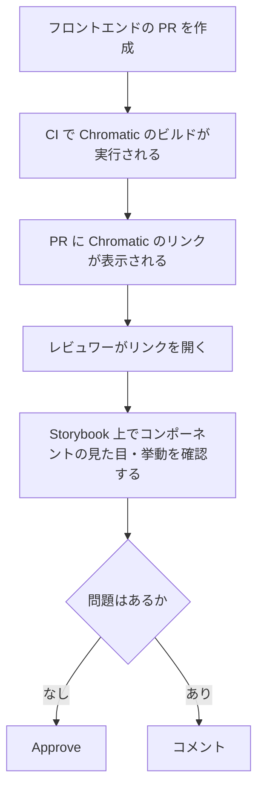

## はじめに

今回は、コーポレートサイトのフロントエンド開発で [Chromatic](https://www.chromatic.com/) を導入し、StorybookをPRレビューのUI確認に使えるようにした話を紹介します。

Storybookはローカルで見るだけだと、レビューで使いにくいことが多いです。ChromaticでPRごとにStorybookをデプロイすることで、レビュワーがPRから直接UIを確認できるようになり、フロントエンドレビューの確認コストが下がりました。

## 導入前の課題

Chromatic導入前は、コンポーネントの見た目確認が手間でした。主に下記3点が課題でした。

### コンポーネントを作っても、ページに置かないと確認しづらい

新しいコンポーネントを作ったとき、実際の見た目を確認するには、次のような作業が必要でした。

- 確認用のページを作る
- 既存ページに一時的に配置する
- レビュワーにそのページを見てもらう

### Storybookは便利だが、ローカルに持ってこないと見られない

Storybookがあればコンポーネント単位では確認できます。ただし、ローカルで動かす前提だと、レビュワー側の確認コストは高くなります。

- リポジトリを手元に持ってくる
- 依存関係を入れる
- Storybookを起動する
- 該当Storyを探す

Storybookが存在していても、レビュー時に自然に使われる状態にはなりにくかったです。

### Storybookのデプロイ環境を自前で用意するのは大変

Storybookをレビューに使うには、どこかにデプロイされている必要があります。自前でホスティング環境を用意するのは手間がかかります。ChromaticはStorybookをホスティングできるサービスとして、比較的簡単に導入できました。

## Chromaticでやったこと

PRを作成すると、自動でChromaticのビルドが走るようにしました。流れは下記のとおりです。

この運用によって、レビュワーはVercel Previewやローカル環境を見に行かなくても、PRから直接コンポーネントの確認ができます。

*PRに表示されるChromaticのリンク*

## レビュー運用で便利だったこと

### PC版 / SP版の確認が楽になった

レビューでは、だいたいPC表示とモバイル表示の両方を見ます。以前はブラウザの幅を変えたり、DevToolsでモバイル表示に切り替えたりしていました。

Chromatic + Storybookでは、Storybook側にviewportを用意しておくことで、レビュワーがそのまま表示を切り替えて確認できます。今回のプロジェクトはコーポレートサイトだったため、PCとSPの2つを用意していました。

*Storybookのviewport切り替え（PC版 / SP版）*

### レビューコメントが具体的になった

Chromatic上で見た目を確認できるため、レビューコメントも具体的になりやすくなりました。たとえば、次のような指摘がしやすくなります。

- SP表示で崩れている
- PC表示では問題ないが、SP版で余白がおかしい
- このコンポーネントのStoryを準備してほしい

コード差分だけではなく、実際のUIを見たうえで会話できるようになりました。

*UIを前提にした具体的なレビューコメントの例*

### 「Storyを準備する」ことがレビュー運用に組み込まれた

Chromaticを使うことで、StorybookのStoryが単なる開発補助ではなく、レビューで求められる成果物になりました。PRで新しいコンポーネントを作るなら、対応するStoryも用意する。これによって、レビュワーがそのPRのUIをStorybook上で確認できます。

## まとめ

Chromaticを導入することで、Storybookを「開発者がローカルで見るカタログ」から「PRレビューでチーム全員が使うUI確認先」にできました。

- PR作成時にChromaticでStorybookが自動デプロイされる
- レビュワーはPRからリンクを開くだけでUI確認できる
- Storyの用意がレビューの前提になる

Storybookは作って終わりではなく、PRレビューの導線に乗せることで、チームのUI確認フローとして機能し始めます。UI確認のコストが下がり、レビューもしやすくなったのが大きな変化でした。

この記事がStorybookやChromaticの導入を検討している方の参考になれば幸いです。
