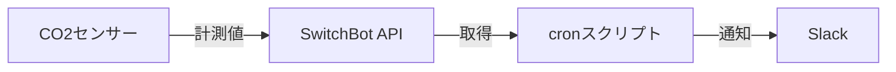

## はじめに

室内のCO2濃度は作業効率に影響を与えると言われていますが、日常的にこれを意識して換気をしている人は多くありません。

空気中のCO2濃度はおおよそ410ppm程度、室内は建築物衛生法により1000ppm以下が基準とされています。部屋の濃度が高くなると息苦しさや眠気などの症状が出てきます。

本記事では、作業部屋のCO2濃度を可視化し、作業へ集中できるようにした取り組みを紹介します。濃度の上昇を通知し、適切なタイミングで換気することで、集中を持続できるようになります。


## 全体構成

**前提条件**：Node.js（v18以上推奨）、SwitchBotアプリ、Slackワークスペースが必要です。環境変数として、SwitchBotのAPIトークン・クライアントシークレット、SlackのIncoming Webhook URLを用意してください。

CO2センサーにはSwitchBotの製品を利用しました。
また、SwitchBot APIからCO2センサーの値を取得するためにハブミニも利用しました。

[SwitchBot CO2 センサー｜空気管理をスマートに – SwitchBot (スイッチボット)](https://www.switchbot.jp/products/switchbot-co2-meter)


[SwitchBot ハブミニ｜リモコンを一つにまとめるスマートリモコン – SwitchBot (スイッチボット)](https://www.switchbot.jp/products/switchbot-hub-mini)


通知先はSlackにしました。
筆者のPC（Mac）上でcronスクリプトを実行し、定期的にCO2濃度を取得・通知します。



## SwitchBot API の概要

https://github.com/OpenWonderLabs/SwitchBotAPI

最初に、SwitchBotのモバイルアプリからAPIトークンとクライアントシークレットを取得します。

<!-- textlint-disable ja-technical-writing/no-mix-dearu-desumasu -->
1. SwitchBotアプリを開き、「プロフィール」→「設定」に移動します
2. 「アプリのバージョン」を10回連続でタップします
3. 「開発者向けオプション」が表示されます
4. 「トークン」と「クライアントシークレット」を取得します
<!-- textlint-enable ja-technical-writing/no-mix-dearu-desumasu -->

取得したAPIトークンとクライアントシークレットを利用して、認証します。

```ts:SwitchBot APIを叩く汎用関数
import crypto from "node:crypto";
import env from "~/env.ts"

async function fetchSwitchBotAPI({ endpoint }: { endpoint: string }) {
  const url = `https://api.switch-bot.com/v1.1${endpoint}`;
  const t = Date.now();
  const nonce = crypto.randomUUID();
  const stringToSign = `${env.token}${t}${nonce}`;
  const sign = crypto
    .createHmac("sha256", env.secret)
    .update(stringToSign)
    .digest("base64");

  const response = await fetch(url, {
    method: "GET",
    headers: {
      Authorization: env.token,
      "Content-Type": "application/json; charset=utf8",
      t: t.toString(),
      sign,
      nonce,
    },
  });

  return response.json();
}
```

次に、CO2センサーのデバイスIDを調べるために、SwitchBotに接続されているデバイス一覧を取得します。

```ts:SwitchBotに接続されているデバイス一覧
export async function getDeviceList() {
  const result = await fetchSwitchBotAPI({
    endpoint: "/devices",
  });
  console.debug(result)
}
```

接続されているCO2センサーとハブミニのdeviceIdが取得できました。

```json:結果
{
  "statusCode": 100,
  "body": {
    "deviceList": [
      {
        "deviceId": "*********",
        "deviceName": "CO2センサー（温湿度計） AF",
        "deviceType": "MeterPro(CO2)",
        "enableCloudService": true,
        "hubDeviceId": ""
      },
      {
        "deviceId": "*********",
        "deviceName": "ハブミニ 69",
        "deviceType": "Hub Mini",
        "enableCloudService": false,
        "hubDeviceId": ""
      }
    ],
    "infraredRemoteList": []
  },
  "message": "success"
}
```

次に、取得したデバイスIDを指定し、現在のCO2センサーの値を取得します。

```ts:デバイスを指定してセンサーの値を取得する
export async function getDeviceStatus(deviceId: string) {
  const result = await fetchSwitchBotAPI({
    endpoint: `/devices/${deviceId}/status`,
  });
  console.debug(result);
}
```

結果から、気温24.4℃、湿度24%、CO2濃度646ppmであることが分かります。

```json:結果
{
  "statusCode": 100,
  "body": {
    "version": "V1.8",
    "temperature": 24.4,
    "battery": 92,
    "humidity": 24,
    "CO2": 646,
    "deviceId": "************",
    "deviceType": "MeterPro(CO2)",
    "hubDeviceId": "DDCC52FA5669"
  },
  "message": "success"
}
```

## 通知設計

次に、取得したセンサーの値をSlackに通知する部分を作成します。
Slack Botを作成してIncoming Webhookを設定し、通知します。

**通知の閾値**：建築物衛生法の基準（1000ppm以下）を参考に、CO2濃度が1000ppmを超えた時点で通知するよう設定しました。閾値は作業環境に合わせて調整してください（例：800ppmで「換気を検討」、1000ppmで「換気推奨」など）。

通知するコードは次のとおりです。

```ts:webhookで通知する関数
export interface CO2Data {
  deviceId: string;
  deviceName: string;
  co2: number;
  temperature: number;
  humidity: number;
  battery: number;
  timestamp: string;
}

export async function notifySlackWebhook(data: CO2Data): Promise<void> {
  const response = await fetch(env.slackWebhookUrl, {
    method: "POST",
    headers: { "Content-Type": "application/json" },
    body: JSON.stringify({
      text: `🟡 CO2濃度通知`,
      blocks: [
        {
          type: "header",
          text: {
            type: "plain_text",
            text: `🟡 CO2濃度: ${data.co2} ppm`,
            emoji: true,
          },
        },
        {
          type: "section",
          fields: [
            { type: "mrkdwn", text: `*デバイス名:*\n${data.deviceName}` },
            { type: "mrkdwn", text: `*ステータス:*\nCO2高め（換気推奨）` },
            { type: "mrkdwn", text: `*CO2濃度:*\n${data.co2} ppm` },
            { type: "mrkdwn", text: `*温度:*\n${data.temperature}°C` },
            { type: "mrkdwn", text: `*湿度:*\n${data.humidity}%` },
            { type: "mrkdwn", text: `*バッテリー:*\n${data.battery}%` },
          ],
        },
        {
          type: "context",
          elements: [{ type: "mrkdwn", text: `測定時刻: ${data.timestamp}` }],
        },
      ],
    }),
  });
}
```


## cron の設計

`node-cron`を利用して5分ごとにプログラムが動作するようにしました。
`cron.schedule`を使って、指定したスケジュールに従って`job`関数を定期実行しています。
`CRON_SCHEDULE`はcron形式の文字列、`TIMEZONE`は実行時のタイムゾーン指定です。
これにより「いつ」「どのタイムゾーンで」処理を回すかを柔軟に制御できます。

```ts
const CRON_SCHEDULE = "*/5 * * * *"
const TIMEZONE = "Asia/Tokyo"

cron.schedule(CRON_SCHEDULE, job, {
  timezone: TIMEZONE,
});
```

またpm2を利用して筆者のMac上でプロセスが常駐するようにしました。
これにより、PCの起動ごとにスクリプトを実行しに行く手間がなくなりました。

次のような設定ファイルを準備し、`pm2 start ecosystem.config.cjs`で実行します。

```js:ecosystem.config.cjs
module.exports = {
  apps: [{
    name: 'co2-bot',
    script: './src/main.ts',
    interpreter: 'node',
    node_args: '--experimental-strip-types',
    instances: 1,
    autorestart: true,
    watch: false,
    max_memory_restart: '500M',
    env: {
      NODE_ENV: 'production'
    },
    error_file: './logs/err.log',
    out_file: './logs/out.log',
    log_file: './logs/combined.log',
    time: true,
    merge_logs: true,
    cron_restart: '0 3 * * *'
  }]
};
```

加えて、Nodeの`experimental-strip-types`を利用してTypeScriptを直接実行できるようにしています。

## まとめ

CO2濃度の可視化により換気のタイミングが分かり、集中を持続できるようになりました。計測から、1人で1時間作業すると660ppm程度、2人で1時間作業すると1000ppmを超えることや、加湿の必要性も分かりました。ぜひ試してみてください。
